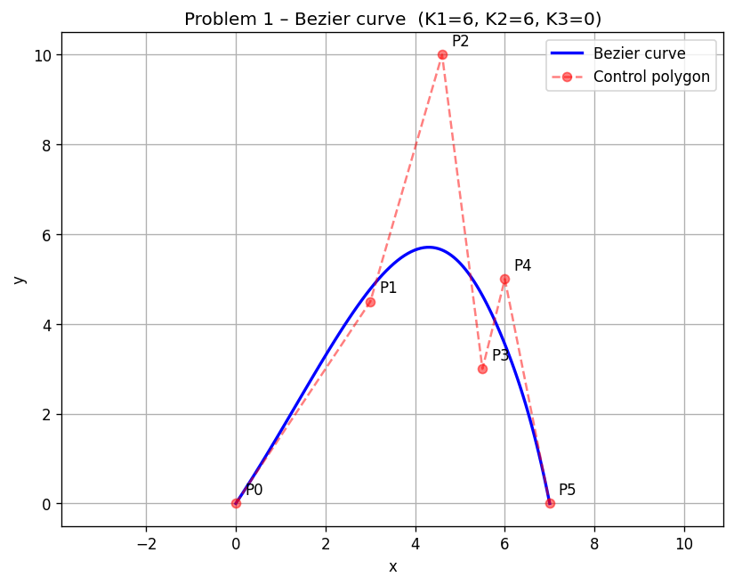
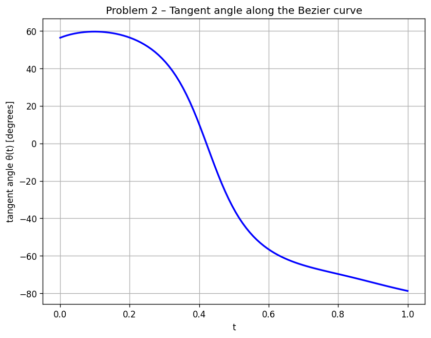
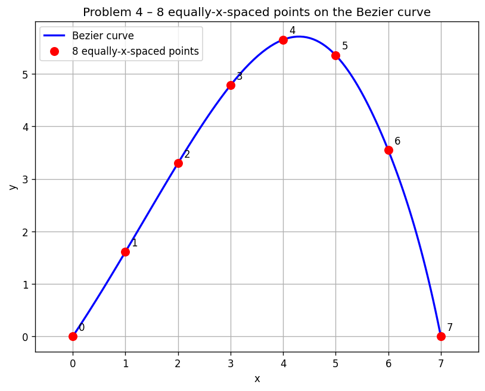
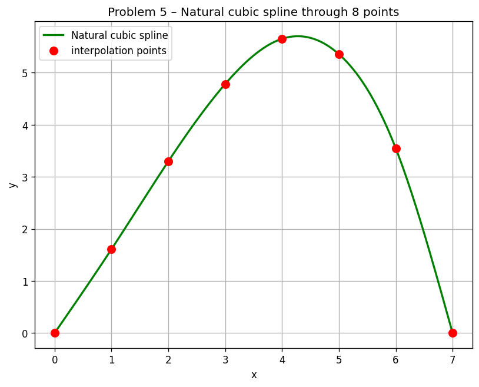
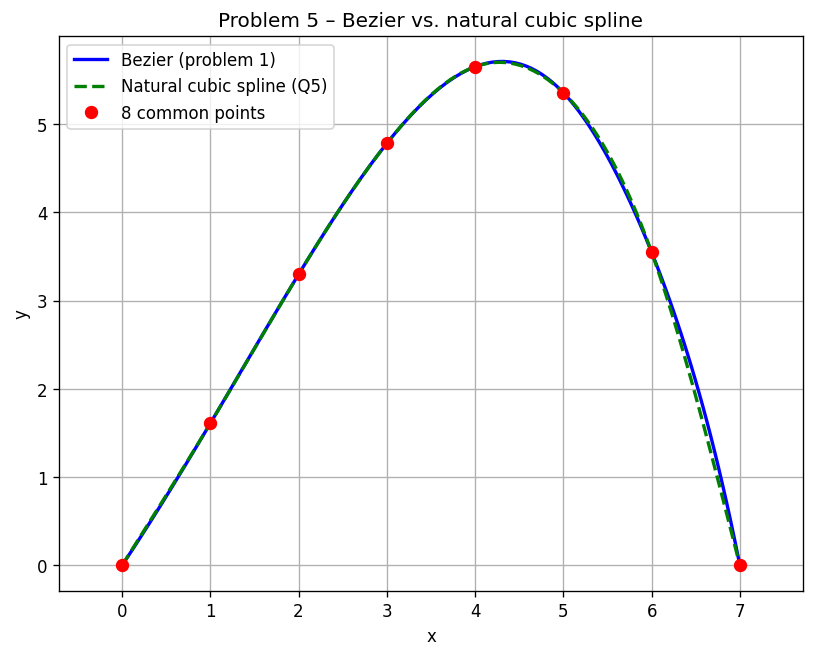
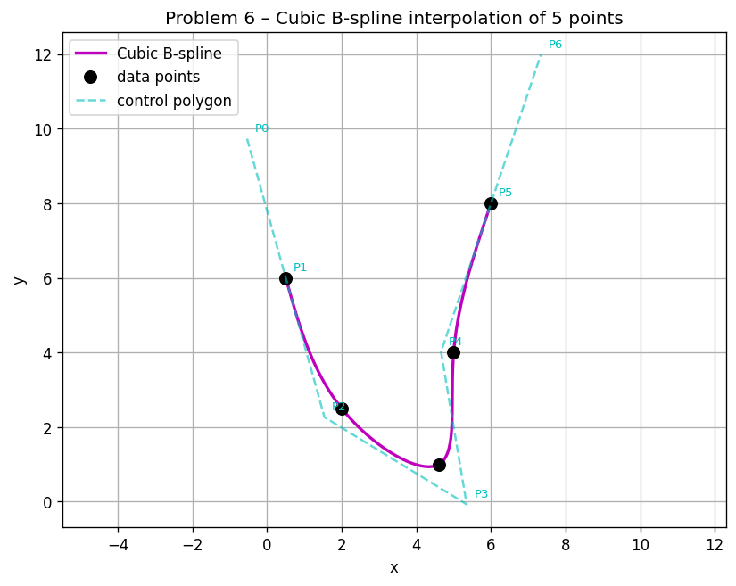
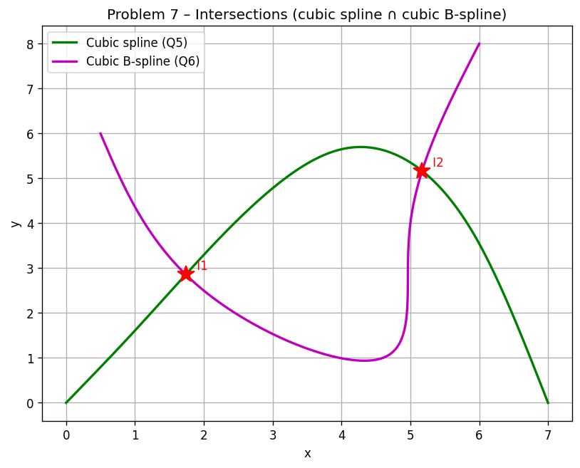

# Numerical Analysis Homework 2025-2026 — Report

**NTUA, School of Mechanical Engineering**
**Course:** Numerical Analysis (K. Giannakoglou / V. Asouti)

**Student key digits:**
- **K1 = 6** (last digit of registration number)
- **K2 = 6** (second-to-last)
- **K3 = 0** (third-to-last)

All algorithms are implemented from scratch in `solution.py`. NumPy is used
only for arrays / dense linear-algebra; matplotlib only for the plots. No
black-box numerical solver is used.

To reproduce: `python3 solution.py` — produces the plots in `plots/` and the
numerical log in `results.txt`.

---

## 1. Bezier curve (6 control points)

### Control points

With `K1=6`, `K2=6`, `K3=0`:

| i | Xi | Yi |
|---|--------------:|--------------:|
| 0 | 0.0  | 0.0 |
| 1 | 3.0  | 4 + K2/12 = **4.500000** |
| 2 | 4 + K1/10 = **4.600000** | 10.0 |
| 3 | 5.5  | 3.0 |
| 4 | 6.0  | 5 + K3/8 = **5.000000** |
| 5 | 7.0  | 0.0 |

### Mathematical equations

The degree-5 Bezier curve is the standard Bernstein form

$$
\mathbf B(t)=\sum_{i=0}^{5}\binom{5}{i}t^{\,i}(1-t)^{5-i}\mathbf P_i,\qquad t\in[0,1].
$$

Substituting the control points and expanding into monomials in `t` we obtain
(coefficients of `t^k`):

|  k  |   x(t)         |   y(t)         |
|----:|---------------:|---------------:|
| 0   |       0.000000 |       0.000000 |
| 1   |      15.000000 |      22.500000 |
| 2   |     -14.000000 |      10.000000 |
| 3   |       7.000000 |    -135.000000 |
| 4   |      -2.000000 |     175.000000 |
| 5   |       1.000000 |     -72.500000 |

Hence

$$
\boxed{\;
\begin{aligned}
x(t)&= 15t -14t^2 + 7t^3 - 2t^4 + t^5,\\
y(t)&= \tfrac{45}{2}t + 10t^2 -135t^3 +175t^4 -\tfrac{145}{2}t^5.
\end{aligned}}
$$

(Sanity check: `x(0)=y(0)=0`, `x(1)=15-14+7-2+1=7`,
`y(1)=22.5+10-135+175-72.5=0` — both endpoints reproduce the
first/last control points, as expected.)

### Plot
The curve was sampled at 100 equally-spaced t (Δt = 1/99) and is plotted with
the control polygon — see `plots/p1_bezier.png`.

---

## 2. Tangent angle along the curve

For a parametric curve the slope is `dy/dx = (dy/dt)/(dx/dt)`. Using
the standard derivative formula for a degree-n Bezier curve,

$$
\mathbf B'(t)=n\sum_{i=0}^{n-1}\binom{n-1}{i}t^{\,i}(1-t)^{n-1-i}(\mathbf P_{i+1}-\mathbf P_i),
$$

so `B'(t)` is itself a degree-4 Bezier curve with control points
`Q_i = 5(P_{i+1}-P_i)`:

| i | Qxi | Qyi |
|---|---:|---:|
| 0 | 15.0 |  22.5 |
| 1 |  8.0 |  27.5 |
| 2 |  4.5 | -35.0 |
| 3 |  2.5 |  10.0 |
| 4 |  5.0 | -25.0 |

The tangent angle (in degrees) is

$$
\theta(t)=\frac{180}{\pi}\,\operatorname{atan2}\bigl(y'(t),\,x'(t)\bigr).
$$

Plotted in `plots/p2_tangent.png`. A few representative values:
`θ(0) = 56.310°`, `θ(0.25) = 51.821°`, `θ(0.5) = −35.078°`,
`θ(0.75) = −67.486°`, `θ(1) = −78.690°`. The angle is monotonically
decreasing on `t∈[≈0.1, 1]`, consistent with the visual shape of the curve
(rising, turning over the maximum, then dropping).

---

## 3. Volume of revolution (Gauss-Legendre quadrature)

The body of revolution about the x-axis has

$$
V=\pi\int_{x(0)}^{x(1)} y(x)^2\,dx
 =\pi\int_{0}^{1} y(t)^{2}\,x'(t)\,dt.
$$

The integrand `g(t) = y(t)² x'(t)` is the product of `(deg 5)² = deg 10` and
`deg 4`, hence a polynomial of **degree 14**. A Gauss-Legendre rule with `m`
nodes is exact on polynomials of degree `2m-1`, so an exact result
needs `m ≥ 8`. Therefore the values at `m = 2,3,4,5` are *approximate*.

The exact analytic value, obtained by polynomial expansion + term-by-term
integration of `g(t)` (every monomial `t^k` contributes `1/(k+1)`) is

$$
V^{\star}=344.572\,848\,084\,958.
$$

### Results

| m | V(m)                | |V(m) − V*|     |
|--:|---------------------:|----------------:|
| 2 | 351.117330512449     | 6.544482×10⁰    |
| 3 | 321.380133749620     | 2.319271×10¹    |
| 4 | 347.119878378522     | 2.547030×10⁰    |
| 5 | 344.545194110158     | 2.765397×10⁻²   |

### Comments
The Gauss rule converges very fast despite the integrand being 14-th degree:
the error drops from 6.5 (m = 2) to ~2.8×10⁻² (m = 5), i.e. **two and a half
orders of magnitude** in three additional nodes. This is the classical
geometric/super-algebraic convergence of Gauss-Legendre on smooth integrands.
The non-monotone jump at m = 3 (worse than m = 2) is normal: error of a
Gauss rule depends on the (2m)-th derivative of the integrand and need not
decrease monotonically.

---

## 4. Eight equally-x-spaced points (Newton-Raphson)

The Bezier curve has `x(0)=0, x(1)=7` and `x'(t) ≥ min(15, 8, 4.5, 2.5, 5)
= 2.5 > 0`, so `x(t)` is strictly increasing and the inverse problem
`x(t) = x*` has a unique solution for every `x* ∈ [0,7]`. We pick

$$
x_i^{\star}=\frac{7\,i}{7}=i,\qquad i=0,1,\dots,7,
$$

and solve `f(t) = x(t) − x*_i = 0` by Newton-Raphson:

$$
\boxed{\;t_{k+1}=t_k-\dfrac{x(t_k)-x^{\star}_i}{x'(t_k)}\;}
$$

with initial guess `t₀ = x*_i / 7`. Tolerance: `|f| < 10⁻¹²`.

### Results (8 points)

| i | x*i | ti    | yi    | iters |
|--:|---------------:|-----------------:|-----------------:|------:|
| 0 | 0.000000 | 0.00000000 | 0.000000 | 1 |
| 1 | 1.000000 | 0.07123777 | 1.609167 | 5 |
| 2 | 2.000000 | 0.15377571 | 3.297141 | 5 |
| 3 | 3.000000 | 0.25244560 | 4.781832 | 6 |
| 4 | 4.000000 | 0.37594681 | 5.650274 | 6 |
| 5 | 5.000000 | 0.54083183 | 5.355261 | 5 |
| 6 | 6.000000 | 0.76681091 | 3.547728 | 4 |
| 7 | 7.000000 | 1.00000000 | 0.000000 | 1 |

### Detailed convergence — `x* = 2`

| k | tk | x(tk) | f = x(tk) − x* |
|--:|---:|---:|---:|
| 0 | 0.2857142857 | 3.29469864 |  1.29470×10⁰  |
| 1 | 0.1344823991 | 1.78045387 | −2.19546×10⁻¹ |
| 2 | 0.1534145566 | 1.99596646 | −4.03354×10⁻³ |
| 3 | 0.1537755795 | 1.99999856 | −1.43664×10⁻⁶ |
| 4 | 0.1537757082 | 2.00000000 | −1.82743×10⁻¹³|

### Detailed convergence — `x* = 5`

| k | tk | x(tk) | f = x(tk) − x* |
|--:|---:|---:|---:|
| 0 | 0.7142857143 | 5.78776700 |  7.87767×10⁻¹ |
| 1 | 0.5221649859 | 4.90202350 | −9.79765×10⁻² |
| 2 | 0.5405198746 | 4.99838940 | −1.61060×10⁻³ |
| 3 | 0.5408317483 | 4.99999956 | −4.44899×10⁻⁷ |
| 4 | 0.5408318345 | 5.00000000 | −3.28626×10⁻¹⁴|

In both cases we observe the classic **quadratic convergence** of Newton's
method: the error roughly squares each step (after the first iteration).

The 8 points are plotted on the Bezier curve in `plots/p4_eqspaced.png`.

---

## 5. Natural cubic spline through these 8 points

The 8 abscissae `x_i = 0, 1, …, 7` are uniform, `h_i = 1`. With
`y_i = (0, 1.6092, 3.2971, 4.7818, 5.6503, 5.3553, 3.5477, 0)` we build a
piecewise-cubic `S(x)` of class `C²`. Letting `M_i = S''(x_i)`, the
natural-spline conditions `M_0 = M_7 = 0` together with the continuity-of-
second-derivative system

$$
h_{i-1}M_{i-1}+2(h_{i-1}+h_i)M_i+h_iM_{i+1}=
6\!\left(\tfrac{y_{i+1}-y_i}{h_i}-\tfrac{y_i-y_{i-1}}{h_{i-1}}\right),
\quad i=1,\dots,n-1
$$

yield a tridiagonal linear system. Solving it gives

| i  | Mi |
|---:|--------------:|
| 0  |  0.00000000 |
| 1  |  0.17022523 |
| 2  | −0.20805769 |
| 3  | −0.55768944 |
| 4  | −1.25868369 |
| 5  | −1.38830539 |
| 6  | −2.26321500 |
| 7  |  0.00000000 |

On each interval `[x_i, x_{i+1}]` the spline is

$$
S_i(x)=\frac{M_i(x_{i+1}-x)^3+M_{i+1}(x-x_i)^3}{6h_i}
+\Bigl(\tfrac{y_i}{h_i}-\tfrac{M_ih_i}{6}\Bigr)(x_{i+1}-x)
+\Bigl(\tfrac{y_{i+1}}{h_i}-\tfrac{M_{i+1}h_i}{6}\Bigr)(x-x_i).
$$

Plotted at 400 sample points in `plots/p5_spline.png`; superimposed against
the Bezier curve in `plots/p5_compare.png`. The two curves are
**visually indistinguishable** at the scale of the plot. A direct numerical
comparison gives a maximum point-wise deviation of approximately
`max_x |y_s(x) - y_B(x)| ≈ 0.18` (occurring near the maximum where the
curvature is largest). The Bezier curve is a single global degree-5
polynomial whereas the spline is a piecewise cubic forced through 8 sampled
points; the small discrepancy is the natural error of the C²-cubic
interpolant on a smooth curve sampled with `Δx = 1`.

---

## 6. Cubic B-spline interpolation of 5 data points

### Data

| i | xi | yi |
|---|---:|---:|
| 0 | 0.5 | 6.0 |
| 1 | 2.0 | 2 + K2/12 = **2.500000** |
| 2 | 4 + K1/10 = **4.600000** | 1.0 |
| 3 | 5.0 | 4.0 |
| 4 | 6.0 | 8 + K3/8 = **8.000000** |

### Setup

Using uniform knot spacing and parameter `u_j = j` at data point `j`,
each segment `S_k(t)`, `t∈[0,1]`, k = 0..3, is

$$
S_k(t)=\tfrac{1}{6}\bigl[
(1-t)^3\mathbf P_k +(3t^3-6t^2+4)\mathbf P_{k+1}
+(-3t^3+3t^2+3t+1)\mathbf P_{k+2}+t^3\mathbf P_{k+3}\bigr].
$$

Imposing `S_k(0) = (x_k, y_k)` for k = 0..3 and `S_3(1) = (x_4, y_4)`
gives 5 equations in the 7 unknown control points `P_0, …, P_6`. Two more
come from the natural boundary conditions `S''(0) = S''(end) = 0`, which
in uniform-B-spline form read

$$
P_0-2P_1+P_2=0,\qquad P_3-2P_4+P_5=0,
$$

and a 7×7 system is solved twice (once for `x`, once for `y`). The
resulting control points are

| i | Pi,x | Pi,y |
|--:|---:|---:|
| 0 | −0.537500 |  9.732143 |
| 1 |  0.500000 |  6.000000 |
| 2 |  1.537500 |  2.267857 |
| 3 |  5.350000 | −0.071429 |
| 4 |  4.662500 |  4.017857 |
| 5 |  6.000000 |  8.000000 |
| 6 |  7.337500 | 11.982143 |

### Explicit polynomial of every segment

Substituting and collecting in monomials, every segment has the form
`x(t)=αx_0+αx_1 t+αx_2 t²+αx_3 t³`,
`y(t)=αy_0+αy_1 t+αy_2 t²+αy_3 t³`:

**Segment 1/4** — between Q0 and Q1:
- `x(t) = 0.500000 + 1.037500 t + 0 · t² + 0.462500 t³`
- `y(t) = 6.000000 − 3.732143 t + 0 · t² + 0.232143 t³`

**Segment 2/4** — between Q1 and Q2:
- `x(t) = 2.000000 + 2.425000 t + 1.387500 t² − 1.212500 t³`
- `y(t) = 2.500000 − 3.035714 t + 0.696429 t² + 0.839286 t³`

**Segment 3/4** — between Q2 and Q3:
- `x(t) = 4.600000 + 1.562500 t − 2.250000 t² + 1.087500 t³`
- `y(t) = 1.000000 + 0.875000 t + 3.214286 t² − 1.089286 t³`

**Segment 4/4** — between Q3 and Q4:
- `x(t) = 5.000000 + 0.325000 t + 1.012500 t² − 0.337500 t³`
- `y(t) = 4.000000 + 4.035714 t − 0.053571 t² + 0.017857 t³`

(One easily checks `S_k(0) = Q_k` and `S_3(1) = Q_4`.)

The curve sampled at 400 points and the control polygon are in
`plots/p6_bspline.png`.

---

## 7. Intersections of the two curves (fixed-point iteration)

The cubic spline of §5 is `y = y_s(x)` for `x∈[0,7]`; the cubic B-spline of
§6 is the parametric curve `(x_b(u), y_b(u))` for `u∈[0,4]`. An
intersection satisfies

$$
F(u)\;:=\;y_b(u)-y_s\!\bigl(x_b(u)\bigr)=0.
$$

This is rewritten as the fixed-point problem
`u = G(u) := u − α F(u)` with constant relaxation α. Convergence of the
basic fixed-point iteration

$$
u_{k+1}=u_k-\alpha\,F(u_k)
$$

requires `|G'(u*)| = |1 − α F'(u*)| < 1`, i.e. `0 < α F'(u*) < 2`. We
estimate `F'(u_0)` numerically (central differences with `ε = 10⁻⁴`) at the
mid-point of each bracket of a sign change of `F`, and pick `α = 1/F'(u_0)`,
which gives `|G'(u*)| ≈ 0` near the root and very fast (effectively
linear-becoming-superlinear in practice) contraction.

A 4000-point sweep of `F(u)` over `[0,4]` reveals **two** sign changes,
hence two intersections.

### Convergence — Intersection 1
α = −0.147653, starting `u₀ = 0.884721`:

| k | uk | F(uk) |
|--:|---:|---:|
| 0 | 0.884721180074 | −1.07131×10⁻³ |
| 1 | 0.884562998104 | −3.02963×10⁻⁸ |
| 2 | 0.884562993630 | −1.71418×10⁻¹² |
| 3 | 0.884562993630 |  8.88×10⁻¹⁶ (≈ 0) |

### Convergence — Intersection 2
α = +0.199305, starting `u₀ = 3.290323`:

| k | uk | F(uk) |
|--:|---:|---:|
| 0 | 3.290322579823 | −6.68142×10⁻⁴ |
| 1 | 3.290455743493 |  2.41921×10⁻⁸ |
| 2 | 3.290455738672 | −1.75149×10⁻¹² |
| 3 | 3.290455738672 | −8.88×10⁻¹⁶ (≈ 0) |

### Intersections found

| # | u* | x* | y* |
|--:|---:|---:|---:|
| 1 | 0.8845629936 | 1.7378432  | 2.8593571 |
| 2 | 3.2904557387 | 5.1715470  | 5.1681144 |

Plotted with red stars on the two curves in `plots/p7_intersections.png`.

---

## Files in this submission

| File | Contents |
|------|----------|
| `solution.py` | All 7 problems implemented from scratch |
| `results.txt` | Full numerical log produced by the script |
| `REPORT.md` | This report |
| `plots/p1_bezier.png` | Problem 1 — Bezier curve |
| `plots/p2_tangent.png` | Problem 2 — tangent angle θ(t) |
| `plots/p4_eqspaced.png` | Problem 4 — 8 equally-x-spaced points |
| `plots/p5_spline.png` | Problem 5 — natural cubic spline |
| `plots/p5_compare.png` | Problem 5 — Bezier vs cubic spline |
| `plots/p6_bspline.png` | Problem 6 — interpolating cubic B-spline |
| `plots/p7_intersections.png` | Problem 7 — intersections |
